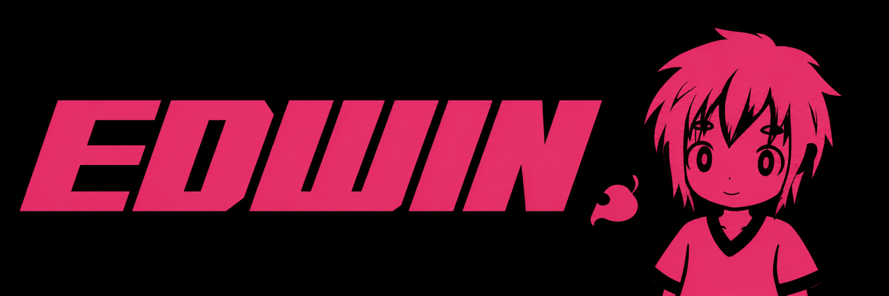

<p align="center">
  
</p>

<div align="center">

### Fullstack Engineer from Mexico 🇲🇽

I build reliable web applications, backend services and cross-platform experiences.<br />
Focused on clean architecture, useful products and continuous learning.

<br />

<a href="mailto:edwin.avilag1999@gmail.com">
  
</a>
<a href="https://github.com/edwinaviladev">
  
</a>

<br /><br />

━━━━━━━━━━ ☆ ★ ☆ ━━━━━━━━━━

</div>

## About me

```python
class Edwin:
    role = "Fullstack Engineer"
    focus = ["Backend", "Web", "Mobile", "Scalable systems"]
    currently_learning = ["Golang", "System Design", "English"]

    def build(self):
        return "Useful software with clean and maintainable code"
```

<div align="center">

## GitHub metrics

<a href="https://github.com/edwinaviladev">
  
</a>
<a href="https://github.com/edwinaviladev">
  
</a>

<br /><br />


<br />


</div>

<div align="center">

## Skills

━━━━━━━━━━ ☆ ★ ☆ ━━━━━━━━━━

<br />


<br /><br />

<table>
  <tr>
    <td align="center"><b>Frontend</b></td>
    <td>HTML · CSS · JavaScript · TypeScript · React</td>
  </tr>
  <tr>
    <td align="center"><b>Mobile</b></td>
    <td>React Native · Expo</td>
  </tr>
  <tr>
    <td align="center"><b>Backend</b></td>
    <td>Python · Django · Golang · Java · REST APIs</td>
  </tr>
  <tr>
    <td align="center"><b>Data</b></td>
    <td>PostgreSQL · MySQL · Redis · SQL</td>
  </tr>
  <tr>
    <td align="center"><b>Tools</b></td>
    <td>Git · Docker · Linux · Postman · GitHub Actions</td>
  </tr>
</table>

<br />

## Let's connect

I enjoy building products, learning new technologies and sharing what I discover along the way.

<br />

<a href="mailto:edwin.avilag1999@gmail.com">
  
</a>
<a href="https://github.com/edwinaviladev">
  
</a>

<br /><br />

━━━━━━━━━━ ☆ ★ ☆ ━━━━━━━━━━

<br />


<br /><br />

<sub>Building, learning and improving one commit at a time.</sub>

</div>
