<h1 align="center"><b>Hi, I'm Edwin</b> </h1>

<p align="center">
  <b>Fullstack Developer | Passionate About Building & Sharing Knowledge</b>
</p>

<p align="center">
  
</p>


## 🚀 About Me

I'm a **Fullstack Developer** who loves creating end-to-end solutions that make a difference. I'm passionate about **clean code**, **scalable architectures**, and **continuous learning**.

What drives me:
- 💻 Building robust backend systems and intuitive user interfaces
- 🤝 Helping others grow and solving problems together
- 📚 Sharing knowledge and learning from the community
- 🎯 Writing maintainable, efficient code that stands the test of time

**I believe in:** Collaboration, continuous improvement, and that the best code is the one that solves real problems.


## 🏷️ Tech Stack

### Backend
<p align="center">
  
  
  
  
  
  
</p>

### Frontend
<p align="center">
  
  
  
  
  
  
</p>

### Databases & Tools
<p align="center">
  
  
  
</p>

<p align="center">
  
  
  
  
  
</p>


## 👨‍💻 What I Do

```java
public class EdwinAvila {
    private String role = "Fullstack Developer";
    private String[] backend = {"Java", "Spring Boot", "PHP", "Laravel"};
    private String[] frontend = {"React", "Vue.js", "JavaScript"};
    private boolean lovesHelping = true;
    private boolean alwaysLearning = true;
    
    public void dailyRoutine() {
        code();
        learn();
        help();
        share();
        improve();
    }
    
    public String philosophy() {
        return "Great code solves real problems and helps others grow";
    }
}
```

**What I Bring to the Table:**
- 🎨 **Frontend Development:** Building responsive, user-friendly interfaces with React & Vue
- ⚙️ **Backend Development:** Creating scalable APIs and services with Spring Boot & Laravel
- 🔐 **Security & Authentication:** JWT, Spring Security, OAuth implementations
- 🗄️ **Database Design:** SQL & NoSQL, optimization, data modeling
- 🐳 **DevOps Basics:** Docker, Git workflows, deployment automation
- 🧪 **Quality Assurance:** Unit testing, integration testing, clean code practices
- 🤝 **Mentoring:** Love helping teammates grow and sharing what I learn


## 📊 GitHub Stats

<p align="center">
  
</p>


## 🎯 Currently

- 🌱 Deepening my knowledge in **microservices architecture** and **design patterns**
- 📚 Exploring **cloud technologies** (AWS/Azure) and **Kubernetes**
- 🏆 Looking to contribute more to **open source** projects
- 💡 Experimenting with **event-driven architectures**
- 🌐 Improving my **English** to connect with more developers worldwide
- 🤝 Always open to **collaborate**, **help**, and **learn from others**


## 💬 Let's Connect!

I'm always happy to:
- 💭 Discuss ideas and solve problems together
- 🎓 Share knowledge or learn something new
- 🤝 Collaborate on interesting projects
- ☕ Just chat about tech and development

<p align="center">
  <a href="mailto:edwin.avilag1999@gmail.com">
    
  </a>
  <a href="https://github.com/edwinaviladev" target="_blank">
    
  </a>
</p>


<div align="center">
  
### 💡 *"The best way to learn is to teach, and the best code is the one that helps others."*


**⭐ From [edwinaviladev](https://github.com/edwinaviladev) with passion and coffee ☕**

</div>
